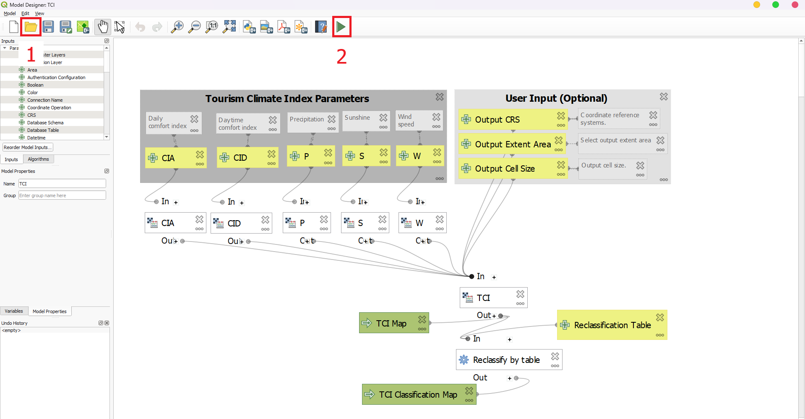
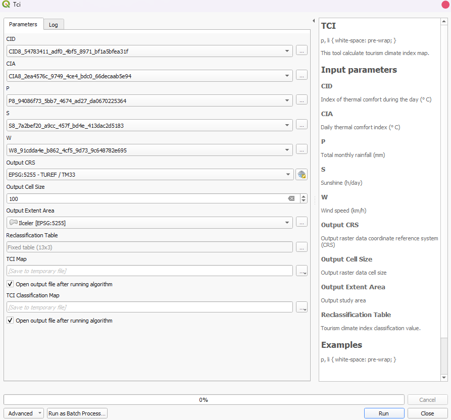
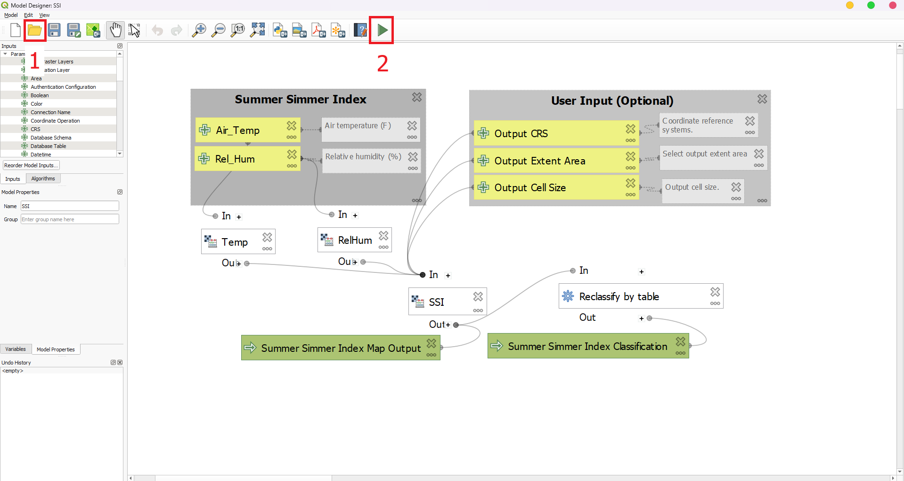
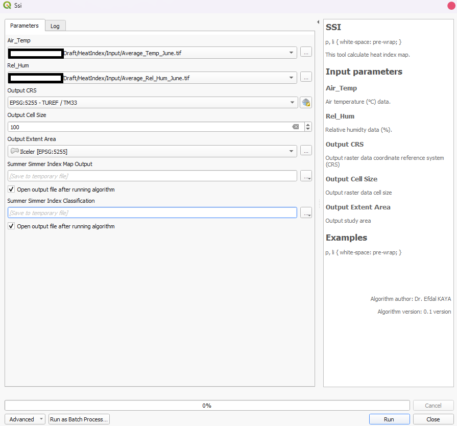
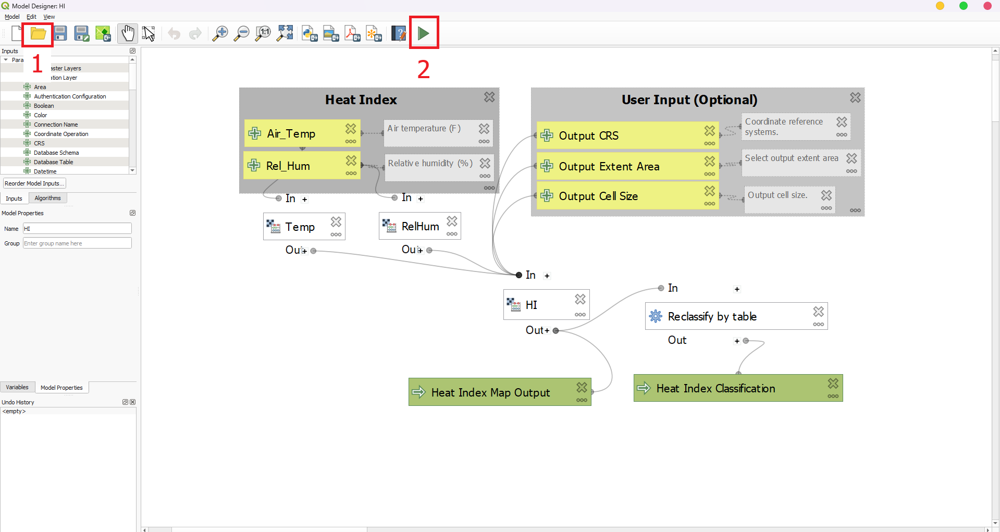
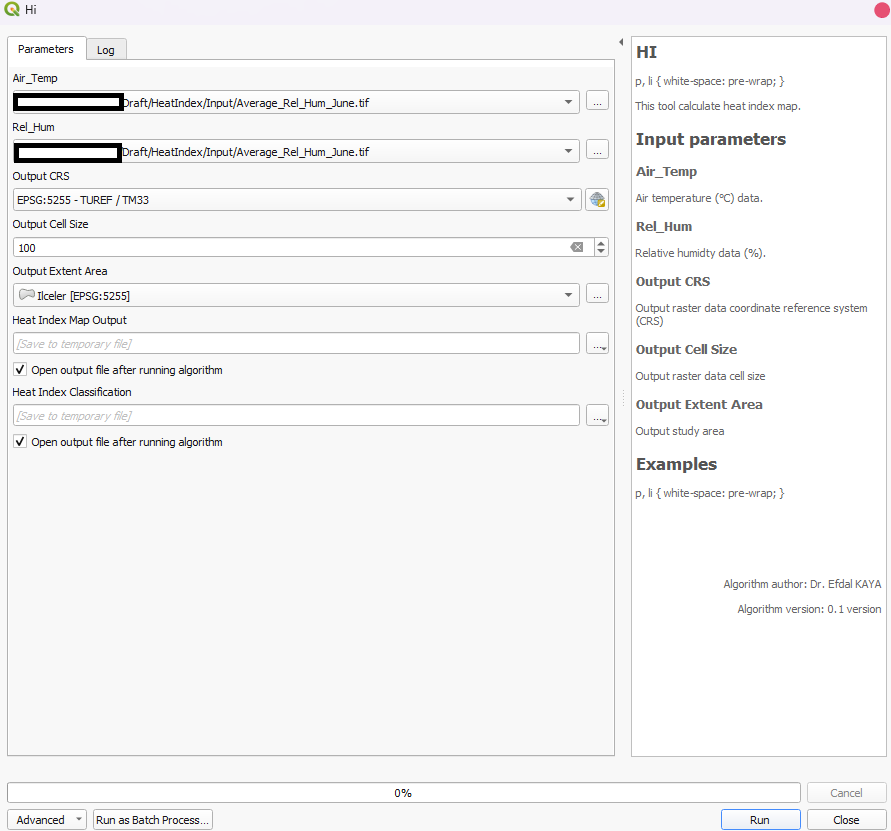

# QGIS_Model
Models can be using to calculate Tourism Climate Index, Heat Index and New Summer Index.

Firstly download this repo. The repo contain input data for models.

### 1. How to calculate tourism climate index using model?

Open QGIS and then open ModelBuilder. 

1. Import model file into ModelBuilder GUI.

2. Run model button.

3. Select input parameters in Input folder.

### 2. How to calculate new summer simmer index using model? 

1. Import model file into ModelBuilder GUI.

2. Run model button.

3. Select input parameters in Input folder.

### 3. How to calculate heat index using model?

1. Import model file into ModelBuilder GUI.

2. Run model button.

3. Select input parameters in Input folder.

